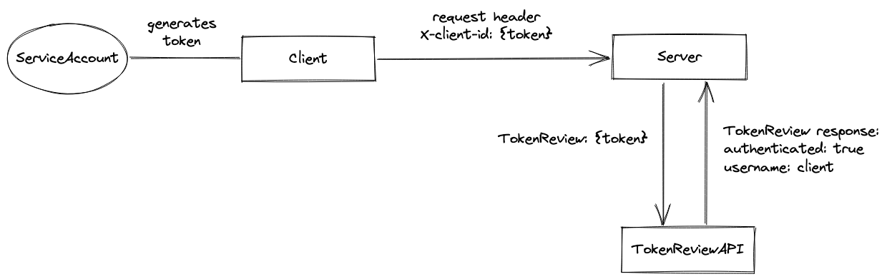

# Using k8s ServiceAccount for service-to-service authentication

PoC of using k8s ServiceAccount token to authenticate between services.

## How it works?



## Running locally using Rancher Desktop

Note: `--namespace k8s.io` needed when using the built image locally in Rancher desktop and make sure to set container `imagePullPolicy: Never` or not the pod won't be able to pull the image.

### Client

```
cd client
nerdctl build --namespace k8s.io -t local/sa-identity-client .
kubectl apply -f infra

kubectl get -nclient pod
kubectl exec -it <pod-name> -- sh

# inside the container
> wget -qSO- app.server:8081/someResource --header x-client-id:test
```

### Server

```
cd server
nerdctl build --namespace k8s.io -t local/sa-identity-server .
k apply -f infra

kubectl get -nserver pod
kubectl exec -it <pod-name> -- sh

# inside the container
> wget -qSO- app.client:8080/refreshToken
```

### Rebuilding and deploying latest version of the app

Since we're using the `latest` tag instead of specific commit version for the image tag, we have to terminate the current pod so that the new pod will be using the latest image from our local registry:

```
kubectl rollout -n {client|server} deploy/app
```

This will restart the Deployment and starts a new pod.